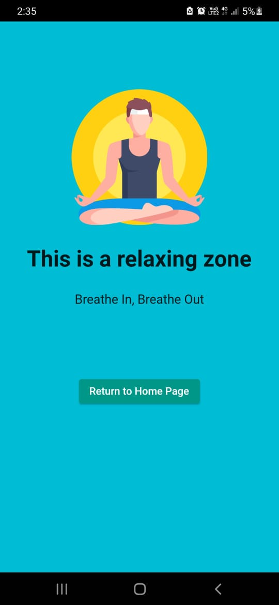

# Portfolio-App-Flutter

This repo consists of a portfolio app made by me.

## In-App Screenshots

  <table>
    <tr>
      <td align="center">Home Page</td>
      <td align="center">Secondary Page</td>
    </tr>
    <tr>
      <td></td>
      <td></td>
    </tr>
  </table>

